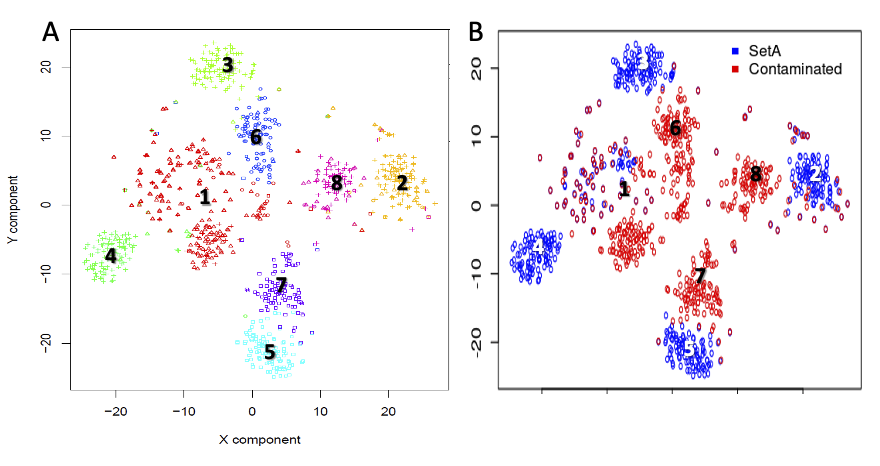
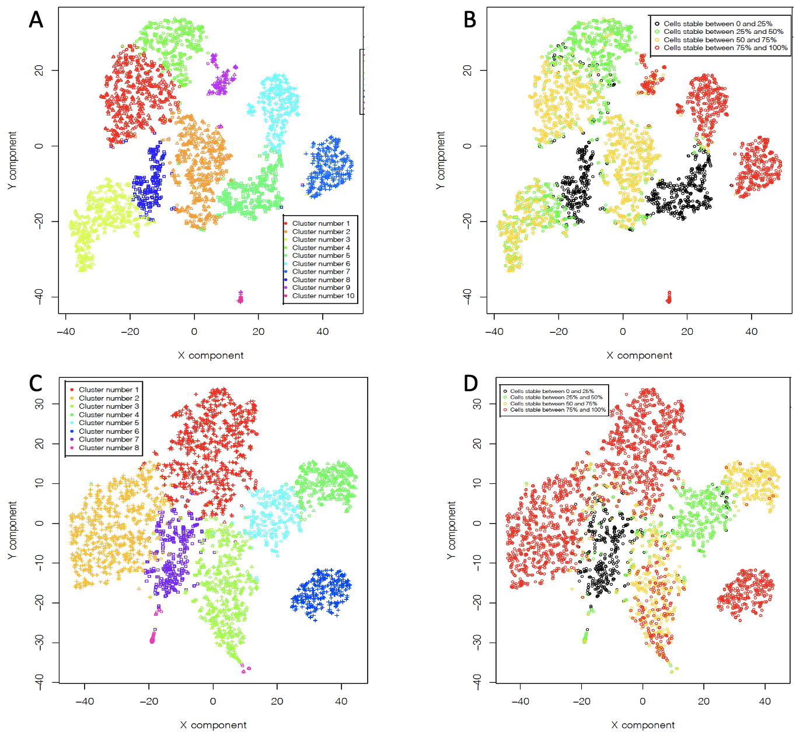
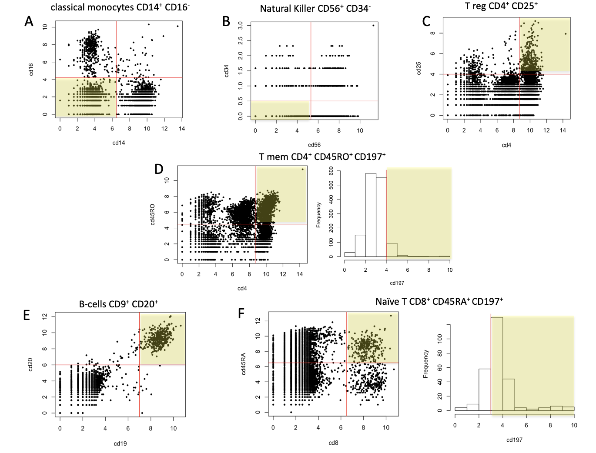
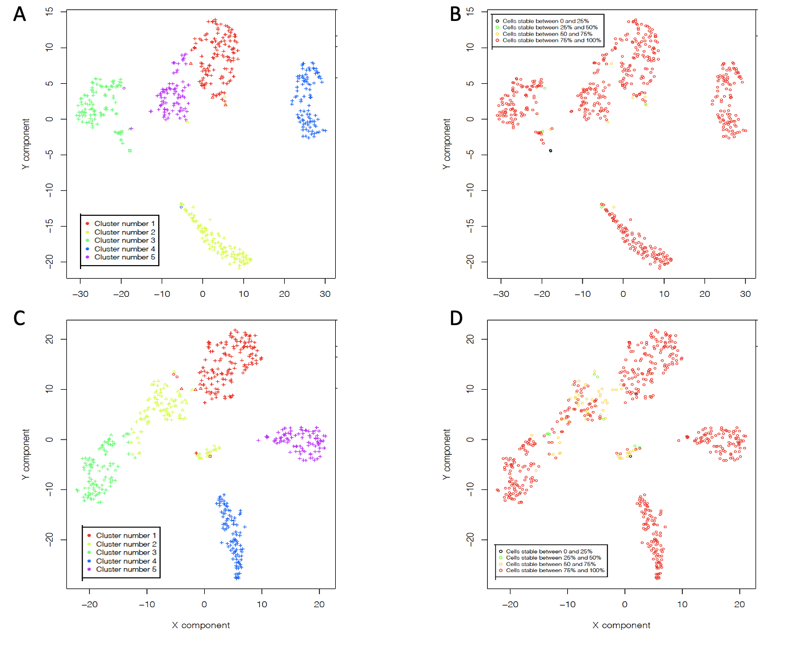
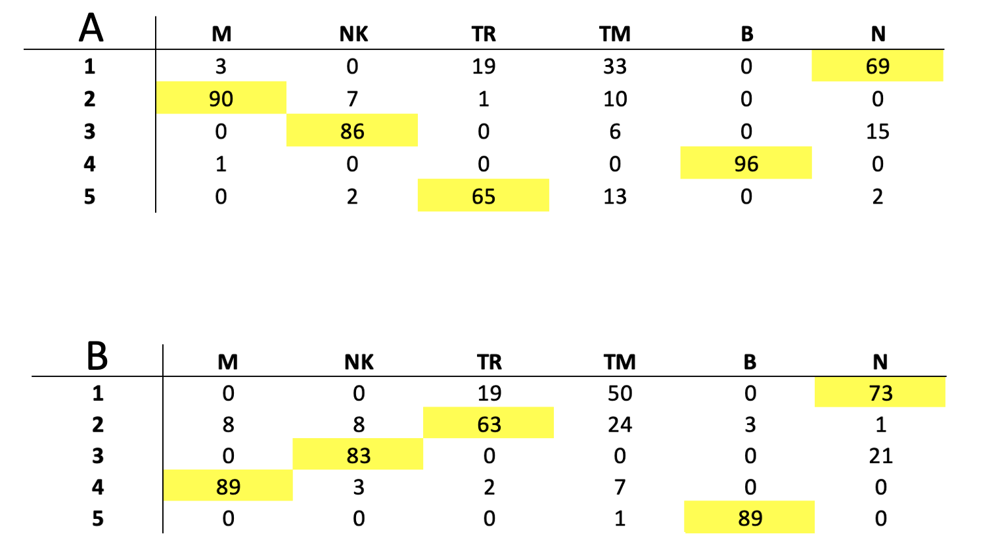

\newpage
\tableofcontents


```{r global_options, include=FALSE}
knitr::opts_chunk$set(fig.pos = 'ht')
```


## Section 1: Introduction


## **Section 2**: Methods


All the methods and analyses described in this thesis were done using R and the Bray Curtis metrics (BCsc) for single cell data analysis was controlled by an rCASC function. All software  fro BCsc metrics was implemented in a docker container deposited at repbioinfo repository at docker hub. All calculated data are available as [figshare project](https://figshare.com/account/home#/projects/94457).

### **Section 2.1**: Datasets

#### **Section 2.1.1**: SetA and setC

SetA and C were prepared to validate rCASC [*Alessandri et al. 2019*](https://pubmed.ncbi.nlm.nih.gov/31494672/). These datasets were generated combining different cell types from Zheng  paper [*Zheng et al. 2017*](https://pubmed.ncbi.nlm.nih.gov/28091601/):

-  setA 100 cells randomly selected for each cell type:
    +  (B) B-cells , (M) Monocytes (100K reads/cell), (S) Hematopoietic stem cells , (NK) Natural Killer cells , (N) Naive T-cells 
    
-  setC 100 cells randomly selected for each cell type: 
    + (C) Cytotoxic T-cells , (M) Monocytes, (T) T-helper cells, (NK) Natural Killer, (N) Naive T-cells

#### **Section 2.1.2**: Contaminated set: setAc30

We constructed a contaminated dataset in which a fraction of genes from setA were substituted with a random set of counts, 30%, from setC, i.e.setAc30. In figure \ref{fig:fig.1}, it shown the co-clustering of setA and setAc30.

```{r fig.1, fig.cap="Co-clustering of setA and setAc30. A) clusters generated by seurat. B) setA and setAc30 cells", echo=FALSE, eval=TRUE, out.width="80%", fig.align="center"}
library(knitr)

```

#### **Section 2.1.3**: Set1 and set2

Datasets 1 and 2 were derived from two PBMC datasets available at 10XGenomics repository. Set1 was generated using version 3.1 chemistry as instead set2 with version 3.0 chemistry. Both datasets included antibodies labeling. Starting from these datasets we constructed set1 and 2, using the following cells:

- CD14+CD16- (Monocytes, M), CD56+CD34- (Natural Killer, NK), CD4+CD25+CD127- (T regulatory, TR), CD4+CD45RO+ccr7+ (T memory, TM), CD19+CD20+ (B cell, B), cd8+cd45ra+ccr7+ (naive T, N)

100 cells were collected for each cell type in the two experiments.
Cells were cleaned up removing all cell with more than 10% mitochondrial genes. Duplicated cells, i.e. those cells showing inconsistent surface makers were removed.
Genes were filtered selecting the top 10000 most variant genes and from them the top 5000  most expressed.  

set1: 94 M, 95 NK, 85 TR, 62 TM, 96 B, 86 N

set2: 97 M, 94 NK, 84 TR, 82 TM, 92 B, 95 N


```{r, echo=F, eval=F}
#how set1 and set2 were generated
#https://www.labome.com/method/T-Cell-Markers-and-B-Cell-Markers.html

setwd("/Volumes/dropbox/Dropbox/data/BCsc/all_data/starting_data/pbmc_NextGEM")
v3.1 <- read.table("matrix.csv", sep=",", header=T, row.names=1)
v3.1_ab <- v3.1[setdiff(seq(1:dim(v3.1)[1]), grep("ENSG", rownames(v3.1))),]
hist(log2(unlist(v3.1_ab) + 1))
write.table(v3.1_ab, "v3.1_ab.csv", sep=",", col.names=NA)

cls3.1 <- read.table("/Users/raffaelecalogero/Desktop/pbmc/pbmc_NextGEM/VandE/Results/VandE/10/VandE_clustering.output.csv", sep=",", header=T, row.names=1)

v3.1_ab <- v3.1_ab[,which(names(v3.1_ab)%in%rownames(cls3.1))]#536

#mono classical CD14+ CD16-
cd14 <- log2(unlist(v3.1_ab[which(rownames(v3.1_ab)=="CD14"),]) + 1)
cd16 <- log2(unlist(v3.1_ab[which(rownames(v3.1_ab)=="CD16"),]) + 1)
plot(cd14, cd16, pch=19, cex=0.5)
abline(v=6.5, col="red")
abline(h=4.2, col="red")
v3.1_ab_cd14pc16m.cells <- intersect(names(cd14)[which(cd14 >= 6.5)], names(cd16)[which(cd16 <= 4.2)])#728

v3.1_mono <- v3.1[,which(names(v3.1)%in%v3.1_ab_cd14pc16m.cells)]
names(v3.1_mono) <- paste(names(v3.1_mono), "_M", sep="")


#NK CD56+ CD34-
cd56 <- log2(unlist(v3.1_ab[which(rownames(v3.1_ab)=="CD56"),]) + 1)
cd34 <- log2(unlist(v3.1_ab[which(rownames(v3.1_ab)=="CD34"),]) + 1)
plot(cd56, cd34, pch=19, cex=0.5)
abline(v=5.3, col="red")
abline(h=0.5, col="red")
v3.1_ab_cd56pc34m.cells <- intersect(names(cd56)[which(cd56 >= 5.3)], names(cd34)[which(cd34 <= 0.5)])#198

v3.1_nk <- v3.1[,which(names(v3.1)%in%v3.1_ab_cd56pc34m.cells)]
names(v3.1_nk) <- paste(names(v3.1_nk), "_NK", sep="")

#CD4+CD25+ Treg 
#https://en.wikipedia.org/wiki/Regulatory_T_cell
cd4 <- log2(unlist(v3.1_ab[which(rownames(v3.1_ab)=="CD4"),]) + 1)
cd25 <- log2(unlist(v3.1_ab[which(rownames(v3.1_ab)=="CD25"),]) + 1)
plot(cd4, cd25, pch=19, cex=0.5)
abline(v=8.7, col="red")
abline(h=4, col="red")
v3.1_ab_cd4pc25p.cells <- intersect(names(cd4)[which(cd4 >= 8.7)], names(cd25)[which(cd25 >= 4)])#274

v3.1_tr <- v3.1[,which(names(v3.1)%in%v3.1_ab_cd4pc25p.cells)]
names(v3.1_tr) <- paste(names(v3.1_tr), "_TR", sep="")


#CD4+CD45RO+ccr7+ Tmem  CD197
#https://en.wikipedia.org/wiki/Memory_T_cell
cd4 <- log2(unlist(v3.1_ab[which(rownames(v3.1_ab)=="CD4"),]) + 1)
cd45RO <- log2(unlist(v3.1_ab[which(rownames(v3.1_ab)=="CD45RO"),]) + 1)
plot(cd4, cd45RO, pch=19, cex=0.5)
abline(v=8.7, col="red")
abline(h=4.5, col="red")
v3.1_ab_cd4pc45rop.cells <- intersect(names(cd4)[which(cd4 >= 8.7)], names(cd45RO)[which(cd45RO >= 4.5)])#890
v3.1_ab_c4pcd45rop <- v3.1_ab[,which(names(v3.1_ab)%in%v3.1_ab_cd4pc45rop.cells)]
cd197 <- log2(unlist(v3.1_ab_c4pcd45rop[which(rownames(v3.1_ab_c4pcd45rop)=="CD197"),]) + 1)
hist(cd197)
abline(v=4, col="red")
v3.1_ab_cd4pcd45ropcd197p.cells <-names(cd197)[which(cd197 >=4)]#79

v3.1_tmem <- v3.1[,which(names(v3.1)%in%v3.1_ab_cd4pcd45ropcd197p.cells)]
names(v3.1_tmem) <- paste(names(v3.1_tmem), "_TM", sep="")


#CD19 B cell
#cd19 <- log2(unlist(v3.1_ab[which(rownames(v3.1_ab)=="CD19"),]) + 1)
#hist(cd19)
#abline(v=7, col="red")
#v3.1_ab_cd19p.cells <- names(cd19)[which(cd19 >= 7)]#337

#CD19+CD20+ B cell
cd19 <- log2(unlist(v3.1_ab[which(rownames(v3.1_ab)=="CD19"),]) + 1)
cd20 <- log2(unlist(v3.1_ab[which(rownames(v3.1_ab)=="CD20"),]) + 1)
plot(cd19, cd20, pch=19, cex=0.5)
abline(v=7, col="red")
abline(h=6, col="red")
v3.1_ab_cd19pcd20.cells <- intersect(names(cd19)[which(cd19 >= 7)], names(cd20)[which(cd20 >= 6)])#332

v3.1_b <- v3.1[,which(names(v3.1)%in%v3.1_ab_cd19pcd20.cells)]
names(v3.1_b) <- paste(names(v3.1_b), "_B", sep="")#332


#cd8+cd45ra+ccr7+ (CD197) naive T
#
cd8 <- log2(unlist(v3.1_ab[which(rownames(v3.1_ab)=="CD8a"),]) + 1)
cd45RA <- log2(unlist(v3.1_ab[which(rownames(v3.1_ab)=="CD45RA"),]) + 1)
plot(cd8, cd45RA, pch=19, cex=0.5)
abline(v=6.5, col="red")
abline(h=6.5, col="red")
v3.1_ab_cd8pc45rap.cells <- intersect(names(cd4)[which(cd8 >= 6.5)], names(cd45RA)[which(cd45RA >= 6.5)])#169
v3.1_ab_c8pcd45rap <- v3.1_ab[,which(names(v3.1_ab)%in%v3.1_ab_cd8pc45rap.cells)]
cd197 <- log2(unlist(v3.1_ab_c8pcd45rap[which(rownames(v3.1_ab_c8pcd45rap)=="CD197"),]) + 1)
hist(cd197)
abline(v=3, col="red")
v3.1_ab_cd8pcd45rapcd197p.cells <-names(cd197)[which(cd197 >=3)]#125

v3.1_n <- v3.1[,which(names(v3.1)%in%v3.1_ab_cd8pcd45rapcd197p.cells)]
names(v3.1_n) <- paste(names(v3.1_n), "_N", sep="")#

set1 <- data.frame(v3.1_mono[, 1:100], v3.1_nk[,1:100], v3.1_tr[,1:100], v3.1_tmem, v3.1_b[,1:100], v3.1_n[,1:100])
write.table(set1, "set1.csv", sep=",", col.names=NA)

#cd8+cd45ra-ccr7+  central T memory too few
#cd8+cd45ra-ccr7- Teff too few


setwd( "/Users/raffaelecalogero/Desktop/pbmc/pbmc_v3_chemistry")
v3.0 <- read.table("matrix.csv", sep=",", header=T, row.names=1)
v3.0_ab <- v3.0[setdiff(seq(1:dim(v3.0)[1]), grep("ENSG", rownames(v3.0))),]
hist(log2(unlist(v3.0_ab) + 1))
write.table(v3.0_ab, "v3.0_ab.csv", sep=",", col.names=NA)

cls3.0 <- read.table("/Users/raffaelecalogero/Desktop/pbmc/pbmc_v3_chemistry/VandE/Results/VandE/8/VandE_clustering.output.csv", sep=",", header=T, row.names=1)

v3.0_ab <- v3.0_ab[,which(names(v3.0_ab)%in%rownames(cls3.0))]#removing low quality cells

#mono classical CD14+ CD16-
cd14 <- log2(unlist(v3.0_ab[which(rownames(v3.0_ab)=="CD14"),]) + 1)
cd16 <- log2(unlist(v3.0_ab[which(rownames(v3.0_ab)=="CD16"),]) + 1)
plot(cd14, cd16, pch=19, cex=0.5)
abline(v=6.5, col="red")
abline(h=4.2, col="red")
v3.0_ab_cd14pc16m.cells <- intersect(names(cd14)[which(cd14 >= 6.5)], names(cd16)[which(cd16 <= 4.2)])#771

v3.0_mono <- v3.0[,which(names(v3.0)%in%v3.0_ab_cd14pc16m.cells)]
names(v3.0_mono) <- paste(names(v3.0_mono), "_M", sep="")


#NK CD56+ CD34-
cd56 <- log2(unlist(v3.0_ab[which(rownames(v3.0_ab)=="CD56"),]) + 1)
cd34 <- log2(unlist(v3.0_ab[which(rownames(v3.0_ab)=="CD34"),]) + 1)
plot(cd56, cd34, pch=19, cex=0.5)
abline(v=5.3, col="red")
abline(h=0.5, col="red")
v3.0_ab_cd56pc34m.cells <- intersect(names(cd56)[which(cd56 >= 5.3)], names(cd34)[which(cd34 <= 0.5)])#197

v3.0_nk <- v3.0[,which(names(v3.0)%in%v3.0_ab_cd56pc34m.cells)]
names(v3.0_nk) <- paste(names(v3.0_nk), "_NK", sep="")

#CD4+CD25+ Treg cd127-
#https://en.wikipedia.org/wiki/Regulatory_T_cel
cd4 <- log2(unlist(v3.0_ab[which(rownames(v3.0_ab)=="CD4"),]) + 1)
cd25 <- log2(unlist(v3.0_ab[which(rownames(v3.0_ab)=="CD25"),]) + 1)
plot(cd4, cd25, pch=19, cex=0.5)
abline(v=8.7, col="red")
abline(h=4, col="red")
v3.0_ab_cd4pc25p.cells <- intersect(names(cd4)[which(cd4 >= 8.7)], names(cd25)[which(cd25 >= 4)])#264

v3.0_tr <- v3.0[,which(names(v3.0)%in%v3.0_ab_cd4pc25p.cells)]
names(v3.0_tr) <- paste(names(v3.0_tr), "_TR", sep="")


#CD4+CD45RO+ccr7+ Tmem  CD197
#https://en.wikipedia.org/wiki/Memory_T_cell
cd4 <- log2(unlist(v3.0_ab[which(rownames(v3.0_ab)=="CD4"),]) + 1)
cd45RO <- log2(unlist(v3.0_ab[which(rownames(v3.0_ab)=="CD45RO"),]) + 1)
plot(cd4, cd45RO, pch=19, cex=0.5)
abline(v=8.7, col="red")
abline(h=4.7, col="red")
v3.0_ab_cd4pc45rop.cells <- intersect(names(cd4)[which(cd4 >= 8.7)], names(cd45RO)[which(cd45RO >= 4.7)])#861
v3.0_ab_c4pcd45rop <- v3.0_ab[,which(names(v3.0_ab)%in%v3.0_ab_cd4pc45rop.cells)]
cd197 <- log2(unlist(v3.0_ab_c4pcd45rop[which(rownames(v3.0_ab_c4pcd45rop)=="CD197"),]) + 1)
hist(cd197)
v3.0_ab_cd4pcd45ropcd197p.cells <-names(cd197)[which(cd197 >=4)]#133

v3.0_tmem <- v3.0[,which(names(v3.0)%in%v3.0_ab_cd4pcd45ropcd197p.cells)]
names(v3.0_tmem) <- paste(names(v3.0_tmem), "_TM", sep="")


#CD19 B cell
#cd19 <- log2(unlist(v3.1_ab[which(rownames(v3.1_ab)=="CD19"),]) + 1)
#hist(cd19)
#abline(v=7, col="red")
#v3.1_ab_cd19p.cells <- names(cd19)[which(cd19 >= 7)]#337

#CD19+CD20+ B cell
cd19 <- log2(unlist(v3.0_ab[which(rownames(v3.0_ab)=="CD19"),]) + 1)
cd20 <- log2(unlist(v3.0_ab[which(rownames(v3.0_ab)=="CD20"),]) + 1)
plot(cd19, cd20, pch=19, cex=0.5)
abline(v=7, col="red")
abline(h=6, col="red")
v3.0_ab_cd19pcd20.cells <- intersect(names(cd19)[which(cd19 >= 7)], names(cd20)[which(cd20 >= 6)])#298

v3.0_b <- v3.0[,which(names(v3.0)%in%v3.0_ab_cd19pcd20.cells)]
names(v3.0_b) <- paste(names(v3.0_b), "_B", sep="")#


#cd8+cd45ra+ccr7+ (CD197) naive T
#
cd8 <- log2(unlist(v3.0_ab[which(rownames(v3.0_ab)=="CD8a"),]) + 1)
cd45RA <- log2(unlist(v3.0_ab[which(rownames(v3.0_ab)=="CD45RA"),]) + 1)
plot(cd8, cd45RA, pch=19, cex=0.5)
abline(v=6.5, col="red")
abline(h=7.8, col="red")
v3.0_ab_cd8pc45rap.cells <- intersect(names(cd4)[which(cd8 >= 6.5)], names(cd45RA)[which(cd45RA >= 7.8)])#125
v3.0_ab_c8pcd45rap <- v3.0_ab[,which(names(v3.0_ab)%in%v3.0_ab_cd8pc45rap.cells)]
cd197 <- log2(unlist(v3.0_ab_c8pcd45rap[which(rownames(v3.0_ab_c8pcd45rap)=="CD197"),]) + 1)
hist(cd197)
v3.0_ab_cd8pcd45rapcd197p.cells <-names(cd197)[which(cd197 >=3)]#107

v3.0_n <- v3.0[,which(names(v3.0)%in%v3.0_ab_cd8pcd45rapcd197p.cells)]
names(v3.0_n) <- paste(names(v3.0_n), "_N", sep="")#

set2 <- data.frame(v3.0_mono[, 1:100], v3.0_nk[,1:100], v3.0_tr[,1:100], v3.0_tmem[,1:100], v3.0_b[,1:100], v3.0_n[,1:100])
write.table(set2, "set2.csv", sep=",", col.names=NA)


#CD4+ T helper
#CD34 HSC
#CD8+ Cytotoxic T
#CD56+ NK
#CD14+ Monocytes
#CD8+/CD45RA+ Naive Cytotoxic T
#CD4+/CD25+ T reg
#CD4+/CD45RA+/CD25- Naive T 

```


## **Section 3**: Results

### **Section 3.1**: Creation of the contaminated dataset setAc30

We have transformed setA contaminating it with 30% of the setC counts, randomly selected.
In brief, descrivere come hai fatto la contaminazione

```{r, echo=F, eval=F}
#inserire il codice utilizzato per generare il dataset sintetico
# ti telefono piu' tardi per l'uso del github dimostrativo per la tesi


```

### **Section 3.2:** Analysis of pbmc_NextGEM and pbmc_v3_chemistry

pbmc_NextGEM dataset is the dataset made of  [5k Peripheral blood mononuclear cells (PBMCs) from a healthy donor with cell surface proteins (Next GEM)](https://support.10xgenomics.com/single-cell-gene-expression/datasets/3.1.0/5k_pbmc_protein_v3_nextgem) available at 10XGenomics repository.

pbmc_v3_chemistry dataset is the dataset made of  [5k Peripheral blood mononuclear cells (PBMCs) from a healthy donor with cell surface proteins (v3 chemistry)](https://support.10xgenomics.com/single-cell-gene-expression/datasets/3.1.0/5k_pbmc_protein_v3) available at 10XGenomics repository.

Both datasets were analysed in the following way:

- Low quality cells, i.e. those containing less that 100 genes were removed. All cells with a ribosomal gene percentage between 10 and 70% and a mitochondrial percentage between 1 and 20% were also retained.

- 10K most variable genes were selected and out of them 5K most expressed genes were selected.

- Seurat [ref] was used to cluster the data using the first 5 PCA components.

- Cluster specific gene prioritization was done with COMET software [ref].


```{r fig.2, fig.cap="rCASC clustering. A) pbmc NextGEM 10 clusters. B) pbmc NextGEM CSS. C) pbmc v3 chemistry 8 clusters. C) pbmc v3 chemistry CSS", echo=FALSE, eval=TRUE, out.width="80%", fig.align="center"}
library(knitr)

```

We detected a total of 10 clusters for pbmc_NextGEM, 7 of them with high CSS score, Fig. \ref{fig:fig.2}AB, and 8 clusters for pbmc_v3_chemistry, 6 of them with high CSS, Fig. \ref{fig:fig.2}CD.

These datasets incorporate a panel of 31 TotalSeq™-B antibodies (BioLegend) that were used to assign the cell types for set1 and set2: CD3, CD4, CD8a, CD11b, CD14, CD15, CD16, CD19, CD20, CD25, CD27, CD28, CD34, CD45RA, CD45RO, CD56, CD62L, CD69, CD80, CD86, CD127, CD137, CD197, CD274, CD278, CD335, PD-1, HLA-DR, TIGIT, IgG1, IgG2a, IgG2b.

### Analysis of set1 and set2


```{r fig.3, fig.cap="Cell type assignment. A) classical monocytes. B) Natural Killer cells. C) pbmc_v3_chemistry 8 clusters. C) T regulatory cells. D) T memory cells. E) B-cells. F) naive T cells", echo=FALSE, eval=TRUE, out.width="80%", fig.align="center"}
library(knitr)

```


In Fig. \ref{fig:fig.3}, are summarised the filters applied to the different combinations of Abs to obtain the subsets of cells we were interested in set1 and 2.

After sub-population selection, from each population the first 100 cells were selected  or in case of fewer cell, all cell were selected. Only cell characterized by a mitochondrial genes percentage between 1 and 10 were kept.

```{r fig.4, fig.cap="rCASC clustering. A) set1 clusters. B) set1 CSS. C) set 2 clusters. D) set2 CSS", echo=FALSE, eval=TRUE, out.width="80%", fig.align="center"}
library(knitr)

```


Inconsistent cells, i.e. cells associated at more that one cell type were removed. 10K most variable genes were selected and out of them 5K most expressed genes were selected. The remain cells were clustered as described for pbmc_NextGEM and pbmc_v3_chemistry. In both cases we obtained 5 clusters, all with very good stability, Fig. \ref{fig:fig.4}.

The content of all clusters is quite homogeneous but those containing T derived cells. naive T cell clusters are contaminated by Tmem (TM) and Treg (TR) cells. The cluster of TR has some contamination by TM, Fig. \ref{fig:fig.5}. 

```{r fig.5, fig.cap="Clusters cell type content. A) set1. B) set2.", echo=FALSE, eval=TRUE, out.width="80%", fig.align="center"}
library(knitr)

```


